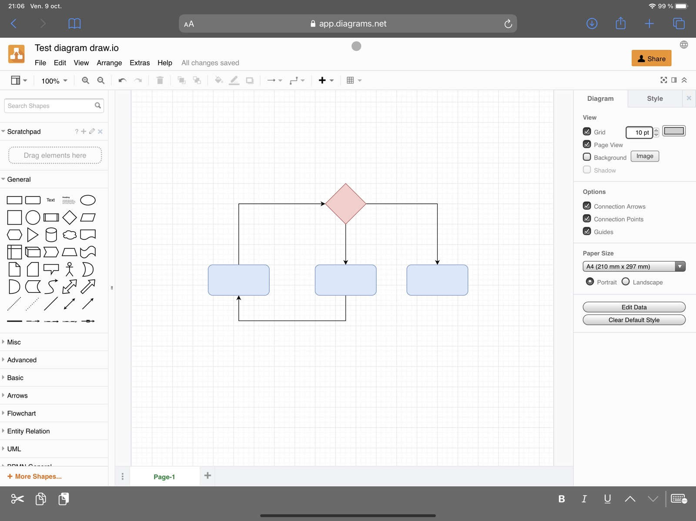

Si vous ne connaissez pas déjà Draw.io, je vous recommande d’aller directement sur le site tester le service. Ce service, **gratuit** au demeurant vous permet de créer des diagrammes de manière très **professionnelle**. Vous verrez il n'a pas grand-chose à envier à Visio de la suite Office.

Si vous préférez utiliser les **applications** plutôt que le service web, sachez qu’il existe un portage (Electron pour les intimes) qui vous permet de faire la même chose, mais dans une **application dédiée**. Elle est **compatible** avec tous les systèmes. 

J’avais testé Diagram sur Mac 💻, mais il est vraiment trop **limité** en termes de positionnement des éléments. Il est certes **beau**, mais il n’a que ça pour lui. 

Le revers de la médaille 🏅 c’est que si vous voulez faire avec Draw.io des présentations qui claquent pour vos clients vous allez être vite déçu ☹️. Les **diagrammes** que vous allez sortir sont **fades**, vous pouvez tout personnaliser, mais ça prend du temps.

La fonctionnalité **indispensable** pour ce genre d’outils pour moi c’est la possibilité de copier le diagramme et de le coller sous forme **d’image**. Ce n’est pas aussi facile avec Draw.io, mais au lieu de faire un « ⌘ + C » il vous faut aller dans le menu faire copier en tant qu’image et hop le tour est joué. 
Donc vous sélectionnez les éléments de votre diagramme, un tour dans le menu pour copier et vous pouvez coller ça dans votre document pour donner de la vie à vos documents.

Aller je repars sur mes spécifications ! 